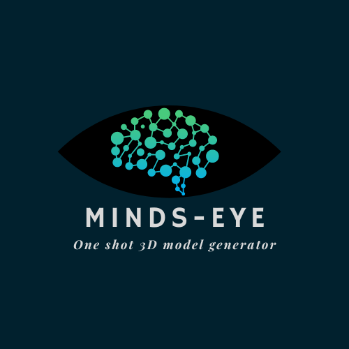
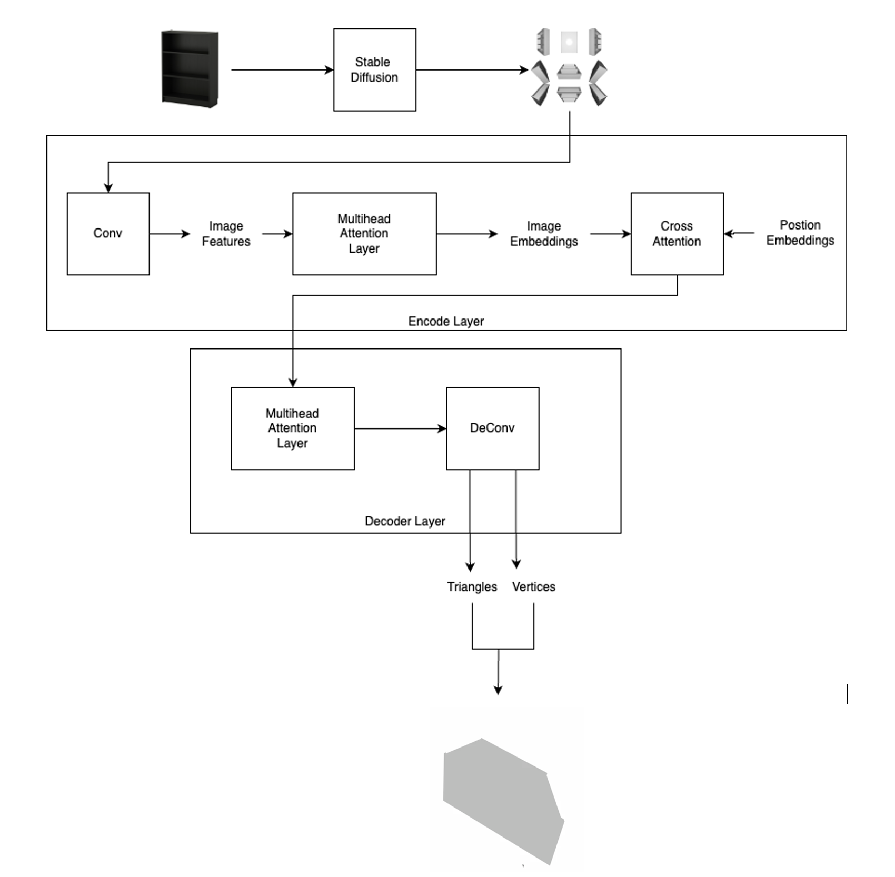
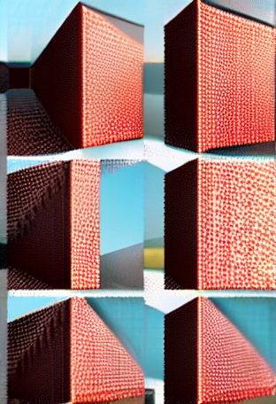
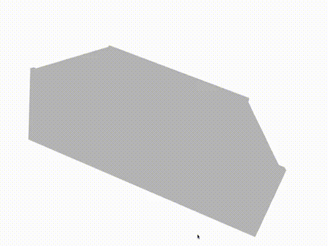
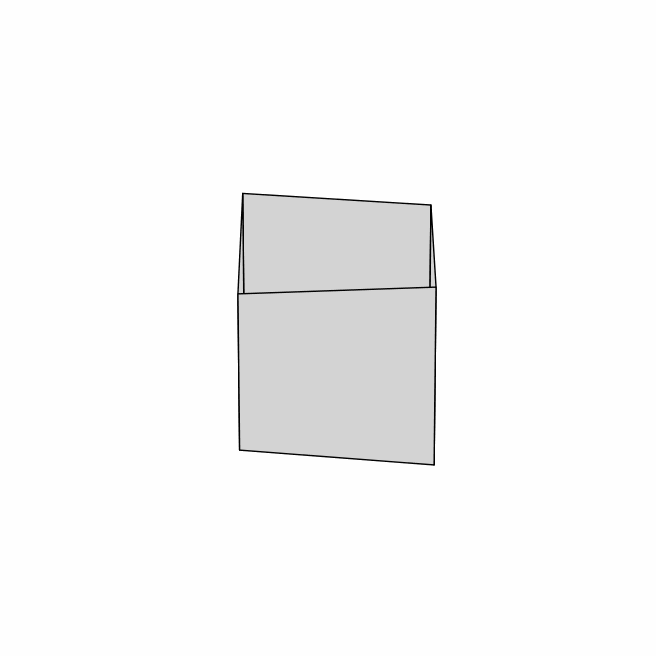

<p align="center">
  <a href="https://github.com/harsh-seth/minds-eye/tree/main">
    
  </a>
</p>

# <center> Minds-Eye </center>
<center> One Shot 3D Model Generator </center>

## High Level Runtime Pipeline
- Input: Given an image
- Output: A 3D model of the object in the image

## Architecture
<p align="center">
    <a href="https://github.com/harsh-seth/minds-eye/tree/main">
        
    </a>
</p>


## Setup
Unix Machine and Windows WSL
```
setup.sh
```

## High Level Training Pipeline
- Given a 3D model, generate n different images from n different view angles
- Train a image-to-images Stable Diffusion model which accepts one of these images and generates an image of the subject from a different view
    - We assume that there is a pipeline that will generate a grid of images given an input image. The grid generation can be done using diffusers controlnet model.
    - We tried to fine tune the controlnet model just as a POC with 10 randomly selected images and for 10 epocs and the model was atleast trying to identify the grid structure and change the object orientation.
    - Sample output:
        <p align="center">
            <a href="https://github.com/harsh-seth/minds-eye/tree/main">
        
            </a>
        </p>
    - For 3D view generation purpose we have written a script [utils/view_generate.py](./utils/view_generator.py) to generate a grid of images.
    - Command: 
    ```
    python utils/view_generate.py
    ```
- Train a images-to-3d-model Stable Diffusion model which accepts images of a subject from n different views and generates a corresponding 3D Model of the subject in the image
    - The architecture explaing the code flow is provided [above](#architecture)
    - To run the training loop use below command:
      - For vertices model
        ```
        python train.py --epochs 25 --batch_size 8 
        ```
      - For triangle model
        ```
        python train.py --epochs 25 --batch_size 8 --triangle 
        ```
- For test/inference we have created [inference.py](inference.py)
    - Command:
    ```
    python inference.py --image_path="/mnt/d/harsh/Downloads/pix3d_full/grid_images/IKEA_DOMBAS_grid.png" --vertices_checkpoint=200 --triangles_checkpoint=20
    ```

## Model Output
- Expected <br/>
    
- Actual <br/>
    
